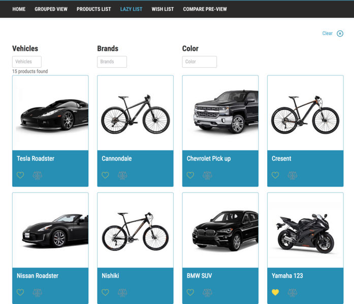
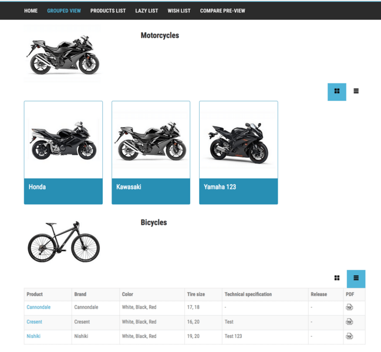

.. include:: ../Includes.txt

.. _user-manual:

Editors
============

**Table of Contents**

.. toctree::
  :maxdepth: 2
  :titlesonly:

  ProductAttributes/Index
  ProductAttributeSets/Index
  ProductTypes/Index
  ProductInheritance/Index
  CategoryManagement/Index
  ProductManagement/Index
  PluginFilters/Index
  ProductPluginSettings/Index

Target group: **Editors**

The product viewing is based on a structure of categories, sub categories, attributes and products, that are stored in a separate system folder in the page tree.
The pages containing products are using the :ref:`product module plugin <product-plugin-settings>`. If you use the filter view (Img. 1), categories and attributes can be used to filter the products. It is also possible to use the product structure (Img. 2) based on the categories, which will add a left hand side category menu instead. The final option is to show the products grouped by category (Img. 3) where the visitor can choose to show products as cards, or in a list.

.. figure:: ../Images/Editors/img1.png
  :width: 350px
  :align: left

  (Img. 1)

  (Img. 2)

  (Img. 3)

The order to create the different components are:

Step 1. :ref:`Attributes <product-attribute>`.

Step 2. :ref:`Attribute sets <product-attribute-sets>`.

Step 3. :ref:`Product Types <product-type>`.

Step 4. :ref:`Product page structure <product-pages>`.

Step 5. :ref:`Products <product-management>`.

Step 6. :ref:`Filters <plugin-filters>` (only used in filter view, and attributes must be of certain type).

With the product module main features you can:

- Add :ref:`products <product-plugin-settings>`
- Add :ref:`categories <product-category>`, :ref:`attributes <product-attribute>` and :ref:`attribute sets <product-attribute-sets>`
- Add images to products and categories
- Add related files and links to products
- Add related products, accessories and sub productor to products
- Use navigation through filter function, using side navigation based on categories or using the grouped view also based on categories
- :ref:`Sorting products listing <product-plugin-settings>` on the frontend alphabetically or via date
- Allows visitor to add products to wishlist
- Allows visitor to compare products

The product module standard feature does not support:

- Payment
- Ordering from product selection
