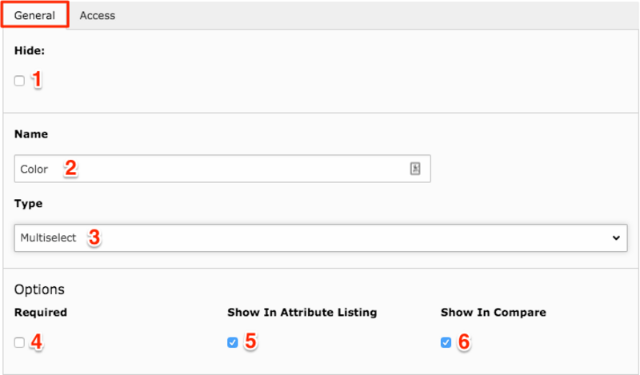
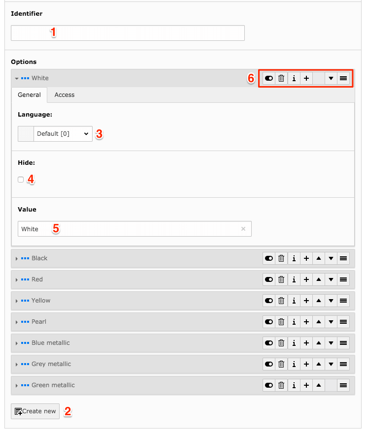

.. include:: ../../Includes.txt

.. _product-attribute:

Product Attributes
===================

.. toctree::
  :maxdepth: 2
  :titlesonly:

  ProductAttributeSets/Index

Attributes are used as additions to the standard product information (mainly name, article number, description and images) and shown in a table below the general product information.
Attributes can for example be available colors, sizes, measurements etc.

Adding attributes
-----------------

The attributes are created and can be added to the category through an attribute set, and then displayed on the products connected to that category. This means that products belonging to a particular category, can have their own set of attributes.

To create an attribute, go to List view and select the product manager (or equivalent) folder in the page tree. In the attribute section, select to create new record. (1.1)

.. figure:: ../../Images/Editors/1.1.png

  Add attributes (1.1)

Setting attribute type
-----------------------
On the 'General' tab you will find the hide function (1) and here you can also add the name of the attribute (2). The name will be shown as a label in filter view and/or as label for product information.

After adding the name, we need to select the type of attribute (3). In this manual we will focus on a multi select type (please see descriptions of all types further down).

If you wish for the attribute to be required, when adding information to the product in backend, check the box (4). This means that the product can not be saved without filling out this attribute field.

Next you need to decide if the attribute should be shown in the listing in frontend, or if it should only be used for internal specification in the backend (5).

The last checkbox is to set if the product should be available in product comparison (6). (1.2)

  Setting attribute type (1.2)

Further down, you can find the options for the attribute. The identifier field is only used by developers (1). You can create new options at the bottom (2) and each option includes a hide function (4) and the value (5) that will be shown on the frontend as a label. The added options will show in a dropdown selection in the product creation of the backend, and selected option in the product will be displayed on the frontend. In the case that you have language layers on your website, you will see selected language for the option at the top of each option (3).

Each option has a section on the right hand side, containing functions to handle the option (6). From left to right; Hide/un-hide, Delete, Information, Add new option after this, Move option up in list, Move option down in list, Drag 'n drop item to change order. (1.3)

  (1.3)

Both the attribute and each opion has an 'Access' tab allowing you to set start and stop dates for publishing. (1.4 + 1.5)

.. figure:: ../../Images/Editors/1.4.png

  (1.4)

.. figure:: ../../Images/Editors/1.5.png

  (1.5)

The different types of attributes
----------------------------------

The different types of attributes apply to how the information is filled out in the product, and then shown in the frontend. The field type options for attributes, indicate how they will be presented in the backend of the product, when creating it.

**Here is a list of the different types, and what they are used for:**

  - Input - used to add a line of free text in the product.
  - Text - allows you to add a text mass.
  - Date Time - adds a calendar field, for example to specify a release date.
  - Dropdown - options are added in the attribute, and in the product, one option can be selected through a dropdown menu (type to use for filter function).
  - Multiselect - options are added in the attribute, and in the product, multiple options can be selected (type to use for filter function).
  - Checkbox - like the multiselect, this allows you to select more than one option, but the options are shown as checkboxes instead in the backend of the product.
  - Link - adds a link field in the product backend, and a link on the frontend.
  - Image - an image can be added in the table of product information. Note that this is not the image that will be shown in the box for product listing views.  

**NOTE!** If the attribute is to be used as a filter, the attribute needs to use the dropdown or multiselect options and not for example a free text field.