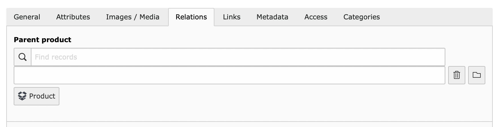
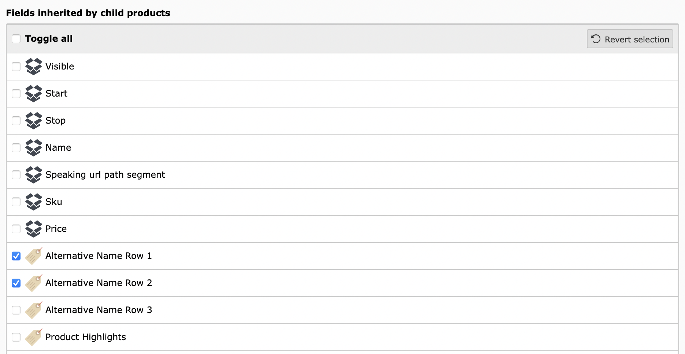
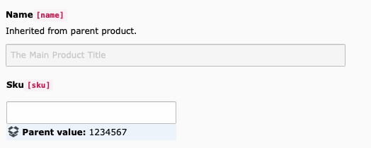

.. include:: ../../Includes.txt

.. _product-inheritance:

==========================================
Product Parents, Children, and Inheritance
==========================================

.. _product-inheritance-parent:

Parent product
==============

Each product has the option to define a parent product. When editing a product,
you can find the *Parent product* field in the *Relations* tab. Each product can
have maximum one parent.

   When editing a product, the *Parent product* field can be found in the
   *Relations* tab.

.. note::

   The product's *Parent product* field was introduced in version 10 of the
   Product Manager. Previously, parent-child relationships were defined in the
   *Children* field on the parent product. This was more complex and created
   problems with inheritance because it allowed a product to have more than one
   parent.

.. _product-inheritance-children:

Child product
=============

A product with a product selected in the *Parent product* field is a
*child product*. A product can have multiple children, but only one parent.

.. note::

   It is not currently possible to see a product's children when editing the
   product.

.. _product-inheritance-inheritance:

Product value inheritance
=========================

Defining a product type and parent product makes it possible to inherit field
values from the parent.

.. _product-inheritance-definingfields:

Defining inherited fields
-------------------------

Inherited fields include normal product fields, as well as
:ref:`attributes <product-attribute>`.

Which fields are inherited from a parent product to a child product is defined
in the :ref:`product-type` record. This means you have to select a product type
for a product in order to enable inheritance.

To select inherited fields, edit a Product Type record and scroll down to
*Fields inherited by child products*. It contains a list of fields and
attributes. From left to right,:

* **A checkbox:** Check this box to make the field or attribute inheritable.
* **An icon** Either a product (box) or attribute (tag) icon to differentiate
   the two types of inherited values.
* **The field or attribute name**

   A shortened list of inheritable fields. Note the box icon for products and
   tag icon for attributes. In this screenshot only the values of the attributes
   *Alternative Name Row 1* and *Alternative Name Row 1* are selected and will
   be inherited.

.. warning::

   We highly recommend making the :ref:`product-type` an inheritable field.
   Which fields are inherited from parent to child is dependent on the of the
   *child* record. This means that it is possible for a parent and child product
   to have different product types. Though useful in some cases, it can lead to
   unexpected behavior.

Recognizing an inherited field
------------------------------

Inherited fields are marked with the text "Inherited from parent product." They
are also disabled and cannot be edited.

Non-inherited fields will have the parent value in a blue box below the field.

   In this example the field *Name* is inherited from the parent product. The
   field *Sku* is not inherited and displayes the parent value ("1234567") in a
   blue box below the field itself.

How inheritance works
---------------------

To ensure best frontend performance, the child products are updated whenever you
save changes to the parent product. This means saving a product with many
children can take a little longer to save.

When inheriting a relation (images, files, other products, etc.), a direct
relation is created to the child product. This means that inherited relations
will be kept if you remove a parent from a product or set a field to no longer
be inheritable.

.. important::

   Information in inherited fields can originate further away than the immediate
   parent. In a more complex product database you may have multiple layers of
   parents and children (grandparents and grandchildren, great-grandparents and
   great-grandchildren, etc).
