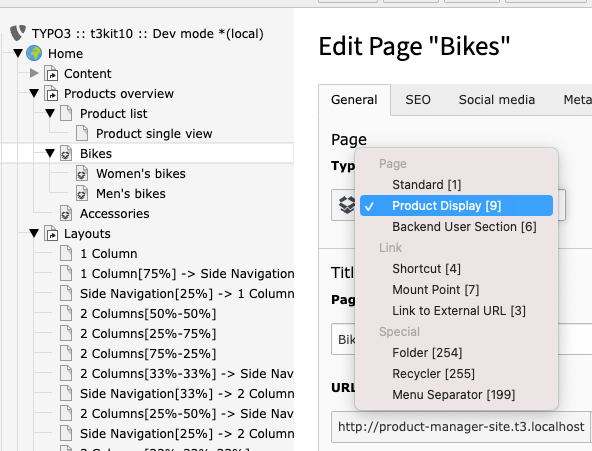
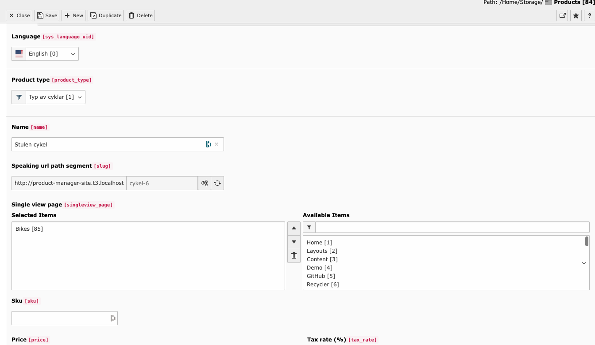
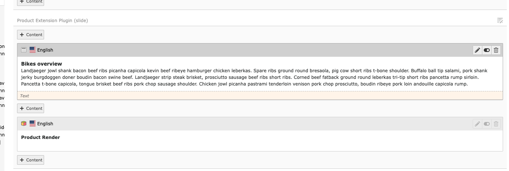
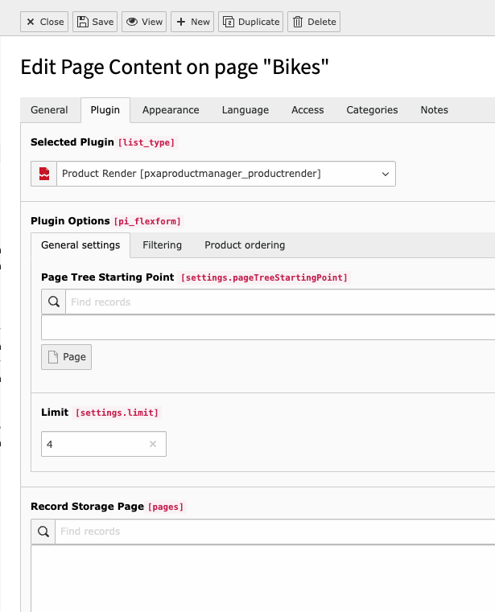

.. include:: ../Includes.txt

.. _installation:

Installation
============

.. _system-folder:

System folder
-------------

Create one system folder (sys folder) for the products, categories, filters, attributes and attribute sets.

Add the clear cache command in the Page TSConfig of the sysfolder:

.. code-block:: typoscript

   TCEMAIN.clearCacheCmd = [ comma separated page uid of product single single and list view ]

.. _product-render:

Product Render
--------------

The product render is the SEO friendly page based setup of handling products! The first
step is to create the necessary category pages (in the PageTree) for the products.

Create the set of pages needed with the dok type called **Product Display**.

Then make sure that the provided backend layout also is added called
**Product Display Sample BE Layout**.

.. figure:: ../Images/category-page-backend-layout.png
   :alt: Adding backend layout to a Category Page in the PageTree.

After the Category pages have been created the next step is to attach a product to a
Category Page. The example below shows how that is done on a Product Record in the
field called **Single view page**.

Now as the products have gotten the correct *Single view page*. The next step is to
add the plugin called **Product Render** to the Category pages to the content part
called **Product Extension Plugin (slide)**.

Here is the possible options for the plugin **Product Render**.

Now both the Category and Products have been setup! This means that the product are now
visible and SEO friendly on the webpage!
