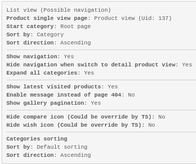
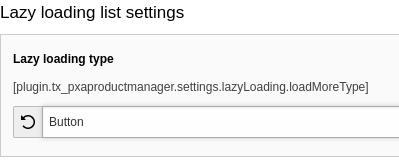
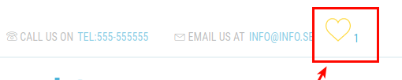
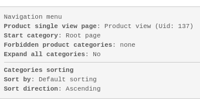
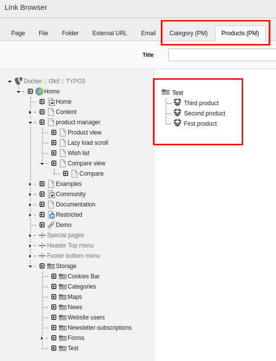

.. include:: ../../Includes.txt

.. _configuration:

Configuration
==============

.. contents:: Table of Contents:
   :backlinks: top
   :class: compact-list
   :depth: 2
   :local:

.. _CreatingThePagesAndSysfolder:

Creating the pages and sysfolder
--------------------------------

.. _Sysfolder:

Sysfolder
^^^^^^^^^
Create **one** sysfolder for the products, categories, filters, attributes and attribute sets.

Add the clear cache command in the Page TSConfig of the sysfolder:

.. code-block:: typoscript

    TCEMAIN.clearCacheCmd = <comma separated page uid of product single and list view>

.. _RootCategory:

Root category
^^^^^^^^^^^^^
Create a System Record Category that will be the root category for all product categories in the sys-folder created earlier.
Choose this category in plugin flexform settings in order to get all available products with sub-categories.

.. _IncludeStaticFromExtension:

Include static from extension
^^^^^^^^^^^^^^^^^^^^^^^^^^^^^
In order to have access to the wish/compare carts and breadcrumbs libraries, the extension’s static typoscript needs to be included.

.. _ExtensionManager:

Extension manager
^^^^^^^^^^^^^^^^^
Configure if plugin should get categories only from current PID of all site.
Configure if Realurl should include SKU field in url generation.

.. _CreatePageAndAddPlugin:

Create page and add plugin
^^^^^^^^^^^^^^^^^^^^^^^^^^
After inserting the plugin on a page, you need to select “Plugin mode” from available options:

.. figure:: ../../Images/Configuration/image1.png

.. _ProductListView:

Product List View
^^^^^^^^^^^^^^^^^
This is the main list view. It could show just a list of product or together with navigation bar depends on flexform settings.
This view has a lot of settings which help user to control plugin output. If product single view page and storage is not set by TS you will need to set it in plugin settings.

By default **List view (possible navigation)** product page is **Single view** at same time and can switch to single view automatically.
This allow to use a “deep link” mode. It means that we can have links like:
**“site.com/products/category/sub-category/product/product-name”**
“deep link” mode require realurl to be configured.
In T3kit it can be done automatically just choosing a “Product page” fixed post var configuration.

.. figure:: ../../Images/Configuration/image3.png

.. _LazyLoadingView:

Lazy Loading View
^^^^^^^^^^^^^^^^^
Unlike list mode, lazy loading allow to load just a some limit amount of products restricted by some criterias and then continue loading if user scroll page down or pressed “Load more” button.
If filters are selected - lazy view will be loaded with filtering possibilities.
In order to change loading products event from page scrolling to “load more” button you need to change TypoScript constant settings:

.. code-block:: typoscript

    plugin.tx_pxaproductmanager {
        settings {
            lazyLoading {
                #Lazy loading type 1: scroll, 2: button
                loadMoreType = 1
            }
    	}
    }

.. _WishList:

Wish list
^^^^^^^^^
Wish list will just output a list of products that was added to wish list by user. Wish list product uids are saved in user cookies.
You can enable wish list function using constant editor, or directly changing TypoScript constants:

.. code-block:: typoscript

    plugin.tx_pxaproductmanager.settings.wishList.enable = 0 // 1 - Enable / Disable
    plugin.tx_pxaproductmanager.settings.wishList.limit = 10 // Limit of products can be added
    plugin.tx_pxaproductmanager.settings.wishList.pagePid = 101 // Page UID with wish list plugin

.. figure:: ../../Images/Configuration/image5.png

Wish list cart is configured by TypoScript library. It’s used to count current number of products in wish list and as a link to wish list page.
In order to get it displayed on a page use something like:

.. code-block:: html

    <f:cObject typoscriptObjectPath="lib.pxaProductManager.wishListCart"/>

.. _CompareView:

Compare view
^^^^^^^^^^^^
Compare view is special view which allows to compare two or more products. User will need to add to a list products he/her want to compare. List is saved in user session.

First need to create a page with “Compare pre-view”, after that page with actual “compare view”. In “Compare pre-view” plugin settings you need to setup PID of compare view page.

You can enable compare function using constant editor, or directly changing TypoScript constants:

.. code-block:: typoscript

    plugin.tx_pxaproductmanager.settings.compareList.enable = 0 // or 1 . Enable/ Disable
    plugin.tx_pxaproductmanager.settings.compareList.pagePid = 101 //. Page Uid of plugin with compare pre-view

.. figure:: ../../Images/Configuration/image7.png

Compare cart is configured by TypoScript library. It’s used to count current number of products in compare view and as a link to compare pre-view page.
In order to get it displayed on a page use something like:

.. code-block:: html

    <f:cObject typoscriptObjectPath="lib.pxaProductManager.compareListCart"/>

.. _ProductSingleViewPage:

Product single view page
^^^^^^^^^^^^^^^^^^^^^^^^
Product single view page can be created as a special separate page with single view plugin mode.
But with new version of product manager this is not longer required. Create a special page only in some special cases.
By default **List** product page is **Single view** at same time. List view will switch to single view automatically.
This allow to use a “deep link” mode. It means that we can have links like:
**“site.com/products/category/sub-category/product/product-name”**
“deep link” mode require realurl to be configured.
In T3kit it can be done automatically just choosing a “Product page” fixed post var configuration.

.. figure:: ../../Images/Configuration/image3.png

.. _Navigation:

Navigation
^^^^^^^^^^
In most cases it’ll be enough to use List mode with enabled navigation.
But if you need just navigation, you can use “Navigation” mode plugin. This mode has also flexform settings:

.. _Breadcrumb:

Breadcrumb
^^^^^^^^^^
Breadcrumbs are generate automatically with “lib.pxaProductManager.breadcrumbs”
Usage:

.. code-block:: html

    <f:cObject typoscriptObjectPath="lib.pxaProductManager.breadcrumbs"/>

.. _ManagingProducts:

Managing products
-----------------

.. _Attributes:

Attributes
^^^^^^^^^^

Attributes are displayed in a separate tab when editing the product.
The following types of attributes are available:

-   Input
-   Text
-   Date time
-   Dropdown
-   Multiselect
-   Checkbox
-   Link
-   Image
-   Label

Depending on which type is selected, additional fields can be displayed. For example, if an attribute has the dropdown type, the options for the dropdown will also need to be created.

There are also 3 checkboxes:

-   Required - to make it a mandatory field in Backend
-   Show In Attribute Listing - show it in the attribute listing on the product single view.
-   Show In Compare - display when comparing products

Special attributes without Show In Attribute Listing can be added manually in the frontend templates by setting the Identifier property.

.. _AttributeSets:

Attribute sets
^^^^^^^^^^^^^^

Attribute sets are collections of attributes that are displayed in the Attributes tab when creating a product. It is possible for multiple attribute sets to share the same attribute.
When adding attributes to an attribute set, the order of the attributes can be arranged the way they should be displayed in backend when editing a product as well as the attribute listing in frontend.

.. _Categories:

Categories
^^^^^^^^^^

The System Records Category is extended with few tabs.
Category information tab
“Category information” tab has image and description fields.
Assign attributes to products
Also categories has “Products attributes” tab where you need to assign attributes set.
All sub-categories of parent category will inherit all attribute sets.
For example if we have next structure

.. code-block:: none

   Root category: Attribute set 1
   └── Sub-category 1: Attribute set 2
       └── Sub-sub-category 2: Attribute set 3

Products that belongs to “Sub-sub-category 2” will have all three attribute sets.

Products that belongs to “Sub-category 1” will have “Attribute set 2” and “Attribute set 1”.

.. _Filters:

Filters
^^^^^^^
Before enabling filters in lazy view - first filter records need to be created. Each filter need to have name used as label on Front-end.
There are two types of filters:

1.  Categories - need choose category one category. Its sub-categories will be used for filtering
2.  Attribute - need to choose one attribute of type dropdown or multiselect.

.. _LinkingProductsAndCategoriesInCKEditor:

Linking products and categories in CKEditor
--------------------------------------------
By default it’s possible to link categories and products in CKEditor.
Just open link menu, select storage folder and choose category or product.
It’s required to have configured product single view Pid TypoScript constant.

.. code-block:: typoscript

    plugin.tx_pxaproductmanager.settings.pagePid = 101

