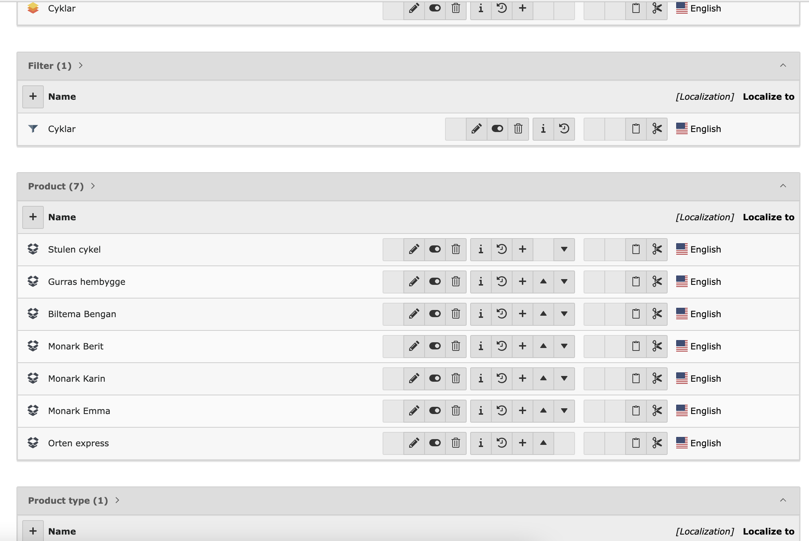

.. include:: ../Includes.txt

.. _introduction:

Introduction
============

.. _about-this-document:

About this extension
--------------------

Product manager is an extension for handling products in TYPO3 Backend.

   Product records in the TYPO3 Backend.

.. _credits:

Credits
-------

Initial parts of this manual was based on :ref:`Inside TYPO3 <t3inside:start>`. It was adjusted and
updated to fit with the pxa_product_manager modules as found in current versions.

.. _feedback:

Feedback
--------

If you find a bug either in this manual or in the pxa_product_manager /
extension please use the `bug tracker <https://github.com/pixelant/pxa_product_manager/issues>`__.

.. _contribution:

Contribution
------------

`Pull requests <https://github.com/pixelant/pxa_product_manager/pulls>`__ are very welcome indeed. Please feel free to contribute features, bug fixes, and improvements.

`Donate to the project through PayPal <https://www.paypal.com/donate/?hosted_button_id=B7YZKNCHTYHRW>`__

