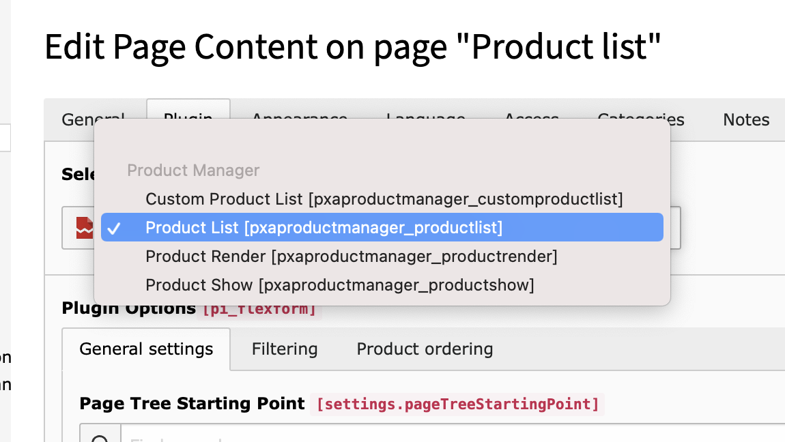
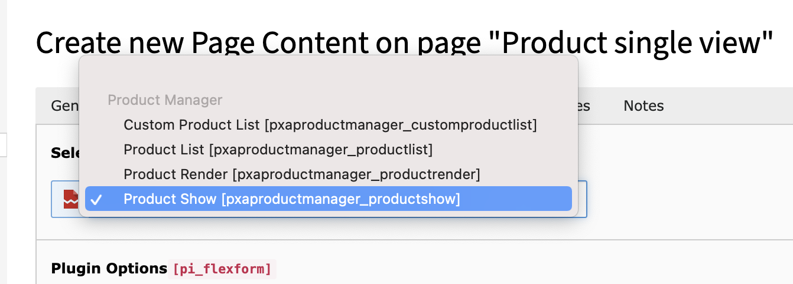

.. include:: ../Includes.txt

.. _legacy-installation:

Legacy Installation
===================

.. _legacy-plugins:

Legacy plugins
--------------

These plugins that are in this section are marked as **legacy** due to the fact
that it is not SEO friendly! Note that these are still supported and will continue to be
so!

.. _system-folder:

System folder
-------------

Create one system folder (sys folder) for the products, categories, filters, attributes and attribute sets.

Add the clear cache command in the Page TSConfig of the sysfolder:

  .. code-block:: typoscript

     TCEMAIN.clearCacheCmd = [ comma separated page uid of product single single and list view ]

.. _product-list-view:

Product List View
-----------------

This is the main list view. It could show just a list of product or together with
navigation bar depends on flexform settings. This view has a lot of settings which
help user to control plugin output. If product single view page and storage is not
set by TS you will need to set it in plugin settings.

.. _product-single-view:

Product Single View
-------------------

Product single view page can be created as a special separate page with single view plugin mode.
By default List view product page is Single view at same time.
List view will switch to single view automatically.

